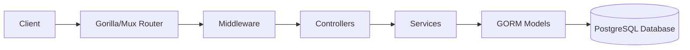
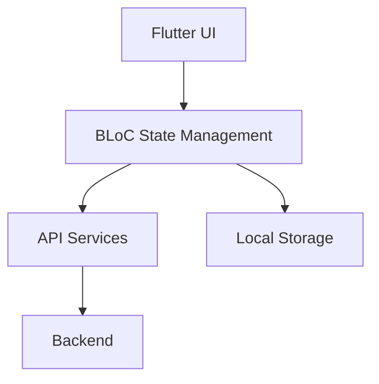

# First-aid Helper - Full-stack Medical Companion Application

## Table of Contents
- [Introduction](#introduction)
- [Features](#features)
- [Architecture Overview](#architecture-overview)
- [Project Structure](#project-structure)
- [Setup Instructions](#setup-instructions)
- [API Documentation](#api-documentation)
- [Testing](#testing)
- [Usage Guide](#usage-guide)
- [Deployment](#deployment)
- [Contributing](#contributing)
- [Implementation Checklist](#implementation-checklist)
- [License](#license)

## Introduction
First-aid Helper is a comprehensive full-stack application designed to help users manage their medical information and receive AI-powered emergency assistance. Built with a Go (Golang) backend using GORM and Gorilla/Mux, and a Flutter frontend for cross-platform compatibility, this application provides essential medical management features for web and mobile devices.

## Features
- **AI-Powered Emergency Chat**: Real-time chat with AI assistant for medical guidance
- **Medical Profile Management**:
  - Personal information storage
  - Medical card with allergies, chronic diseases, blood type
  - ID number and series storage
- **Drug Manager**:
  - Medication tracking with details
  - Expiration date monitoring
  - Automatic reminder system
- **Medical Document Manager**: Secure storage for medical documents
- **Cross-Platform Support**: Web and mobile (iOS/Android) compatibility

## Architecture Overview

### Backend Architecture


### Frontend Architecture


## Project Structure

### Backend
```text
backend/
├── controllers/            # Request handlers
│   ├── chats.go            # AI chat controller
│   ├── documents.go        # Document management
│   ├── drugs.go            # Medication operations
│   ├── groups.go           # User groups
│   ├── medical_cards.go    # Medical card operations
│   ├── messages.go         # Message handling
│   ├── users.go            # User management
│   └── utils.go            # Helper functions
├── handlers/               # Router and middleware
│   ├── middleware.go       # Authentication and logging
│   └── router.go           # Route definitions
├── models/                 # Database models
│   ├── chats.go
│   ├── documents.go
│   ├── drugs.go
│   ├── groups.go
│   ├── medical_cards.go
│   ├── messages.go
│   └── users.go
├── services/               # Business logic
│   └── services.go         # Core service implementations
├── tests/                  # Test suites
│   └── integration/        # Integration tests
│       ├── auth_test.go
│       ├── chat_test.go
│       ├── docs_test.go
│       ├── drugs_test.go
│       └── testutils.go    # Testing utilities
├── testdata/               # Test data files
├── env                     # Environment configuration
├── go.mod                  # Go dependencies
├── go.sum                  # Dependency checksums
└── main.go                 # Application entry point
```

### Frontend
```text
frontend/
├── lib/                    # Main application code
│   ├── src/
│   │   ├── auth/           # Authentication flows
│   │   ├── chat/           # AI chat interface
│   │   ├── profile/        # User profile management
│   │   ├── drugs/          # Medication management
│   │   ├── documents/      # Document storage
│   │   └── utils/          # Helper functions
│   ├── main.dart           # Application entry point
│   └── app.dart            # Main application widget
├── android/                # Android-specific files
├── ios/                    # iOS-specific files
├── test/                   # Test files
├── pubspec.yaml            # Flutter dependencies
├── pubspec.lock            # Locked dependencies
└── ...                     # Other Flutter project files
```

## Setup Instructions

### Prerequisites
- Go 1.24+ (for backend)
- Flutter 3.0+ (for frontend)
- PostgreSQL 12+


### Backend Setup

1. Clone the repository:
```bash
git clone https://github.com/Bitochki-s-sirom/first-aid-helper.git
cd first-aid-helper/backend
```

2. Set up environment variables:
```bash
touch .env
```
Add GEMINI_API_KEY and DSN. For details contact the development team.

3. Install dependencies:
```bash
go mod download
```

4. Start the server:
```bash
go run main.go
```

### Flutter setup

1. Navigate to frontend directory:
```bash
cd ../frontend
```

2. Install dependencies:
```bash
flutter pub get
```

3. Configure API endpoint:
```bash
# Edit lib/src/utils/constants.dart
const String API_BASE_URL = "http://localhost:8080";
```

4. Run the application:
```bash
flutter run
```

## API Documentation

The backend API follows RESTful conventions and is documented using Swagger. After starting the backend server, access the API documentation at:
```
http://localhost:8080/swagger/
```

## API Endpoints

### Authentication Endpoints
| Endpoint          | Method | Description                                     | Authentication Required |
|-------------------|--------|-------------------------------------------------|--------------------------|
| `/`               | GET    | Test page for debugging                         | ❌                       |
| `/signup`         | POST   | Register a new user account                     | ❌                       |
| `/login`          | POST   | Authenticate user and obtain access token       | ❌                       |
| `/swagger/`       | GET    | Access Swagger API documentation                | ❌                       |

### User Profile Endpoints
| Endpoint          | Method | Description                                     | Authentication Required |
|-------------------|--------|-------------------------------------------------|--------------------------|
| `/auth/me`        | GET    | Get current user's profile information          | ✔️                       |
| `/auth/me`        | POST   | Update current user's profile information       | ✔️                       |

### Medication Management Endpoints
| Endpoint                     | Method | Description                                     | Authentication Required |
|------------------------------|--------|-------------------------------------------------|--------------------------|
| `/auth/drugs`                | GET    | List all medications for current user           | ✔️                       |
| `/auth/drugs/add`            | POST   | Add a new medication record                     | ✔️                       |
| `/auth/drugs/remove/{id}`    | POST   | Remove a medication by ID                       | ✔️                       |

### Document Management Endpoints
| Endpoint                     | Method | Description                                     | Authentication Required |
|------------------------------|--------|-------------------------------------------------|--------------------------|
| `/auth/documents`            | GET    | List all medical documents for current user     | ✔️                       |
| `/auth/documents/add`        | POST   | Upload a new medical document                   | ✔️                       |

### AI Chat Endpoints
| Endpoint                     | Method | Description                                     | Authentication Required |
|------------------------------|--------|-------------------------------------------------|--------------------------|
| `/auth/chats`                | GET    | List all chat sessions for current user         | ✔️                       |
| `/auth/new_chat`             | POST   | Create a new AI chat session                    | ✔️                       |
| `/auth/chats/{id}`           | GET    | Get chat messages by chat session ID            | ✔️                       |
| `/auth/send_message`         | POST   | Send a new message in an active chat session    | ✔️                       |

### Path Parameters
- `{id}`: Numeric ID of the resource (e.g., `123`)

### Key notes about the API:
1. **Authentication**: Endpoints under */auth* require valid authentication token
2. Path Parameters:
    - *{id}* must be a numeric value (regex: [0-9]+)
    - *Example*: /auth/drugs/remove/25
3. Request Format:
    - POST requests typically require JSON payloads
    - Include ```Authorization: Bearer <token>``` header for protected endpoints
4. Response Format: JSON payloads with standardized response structures
For detailed request/response schemas and examples, visit the interactive Swagger documentation at /swagger/ when the server is running.

## Testing

### Backend Testing
Integration tests are located in the ```tests/integration``` directory. To run tests:
```bash
cd backend
go test -v ./tests/integration/...
```

Key test files:
- ```auth_test.go```: Authentication flow tests
- ```chat_test.go```: AI chat functionality tests
- ```docs_test.go```: Document management tests
- ```drugs_test.go```: Medication operations tests

### Flutter Testing
Run Flutter tests with:
```bash
\cd frontend
flutter test
```

## Usage Guide

### Setting Up Your Profile
1. Register a new account
2. Navigate to Profile section
3. Complete your personal information
4. Set up your medical card with:
    - Blood type
    - Known allergies
    - Chronic conditions

### Managing Medications
1. Go to Drug Manager
2. Add a new medication:
    - Enter drug name and dosage
    - Set start and end dates
    - Add usage instructions
3. View expiration warnings for medications

### Using AI Emergency Chat
1. Using AI Emergency Chat
2. Describe your symptoms or medical situation
3. Receive AI-powered guidance
4. Follow recommended first-aid steps
5. Save chat history for future reference

### Storing Medical Documents
1. Go to Document Manager
2. Upload images or scanned documents
3. Organize by category (prescriptions, reports, etc.)


## Contributing
We welcome contributions! Please follow these steps:

1. Fork the repository
2. Create a new branch '''(git checkout -b feature/your-feature)'''
3. Commit your changes '''(git commit -am 'Add some feature')'''
4. Push to the branch '''(git push origin feature/your-feature)'''
5. Create a new Pull Request

Please ensure all contributions include:
- Appropriate tests
- Updated documentation
- Consistent coding style


## Implementation checklist

### Technical requirements (20 points)
#### Backend development (8 points)
- [x] Go-based backend (3 points)
- [x] RESTful API with Swagger documentation (2 point)
- [x] PostgreSQL database with proper schema design (1 point)
- [x] JWT-based authentication and authorization (1 point)
- [x] Comprehensive unit and integration tests (1 point)

#### Frontend development (8 points)
- [x] Flutter-based cross-platform application (mobile + web) (3 points)
- [x] Responsive UI design with custom widgets (1 point)
- [x] State management implementation (1 point)
- [x] Offline data persistence (1 point)
- [ ] Unit and widget tests (1 point)
- [x] Support light and dark mode (1 point)

#### DevOps & deployment (4 points)
- [x] Docker compose for all services (1 point)
- [x] CI/CD pipeline implementation (1 point)
- [x] Environment configuration management using config files (1 point)
- [x] GitHub pages for the project (1 point)

### Non-Technical Requirements (10 points)
#### Project management (4 points)
- [x] GitHub organization with well-maintained repository (1 point)
- [x] Regular commits and meaningful pull requests from all team members (1 point)
- [ ] Project board (GitHub Projects) with task tracking (1 point)
- [x] Team member roles and responsibilities documentation (1 point)

#### Documentation (4 points)
- [x] Project overview and setup instructions (1 point)
- [x] Screenshots and GIFs of key features (1 point)
- [x] API documentation (1 point)
- [x] Architecture diagrams and explanations (1 point)

#### Code quality (2 points)
- [x] Consistent code style and formatting during CI/CD pipeline (1 point)
- [x] Code review participation and resolution (1 point)

### Bonus Features (up to 10 points)
- [ ] Localization for Russian (RU) and English (ENG) languages (2 points)
- [ ] Good UI/UX design (up to 3 points)
- [x] Integration with external APIs (fitness trackers, health devices) (up to 5 points)
- [ ] Comprehensive error handling and user feedback (up to 2 points)
- [ ] Advanced animations and transitions (up to 3 points)
- [ ] Widget implementation for native mobile elements (up to 2 points)

Total points implemented: 28/30

## License
This project is licensed under the [MIT License](LICENSE).

---
**Disclaimer**: This application provides general medical information and should not be used as a substitute for professional medical advice, diagnosis, or treatment. Always seek the advice of your physician or other qualified health provider with any questions you may have regarding a medical condition.